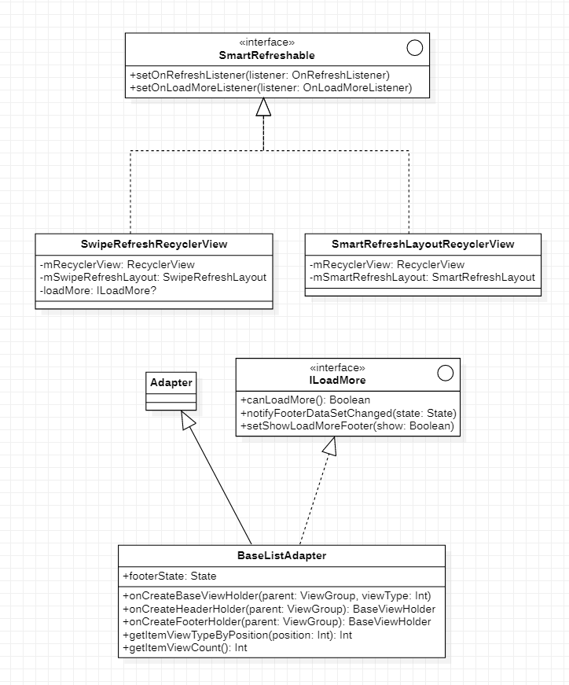

# SmartRefreshRecyclerView
智能列表显示工具

特点如下：

* 专注列表下拉刷新、加载更多
* api精简易上手
* 依赖接口，而不依赖实现
* 扩展性好

## 1、能干什么事

* 下拉刷新
* 加载更多
* 线性列表
* 网格列表
* 瀑布流列表

## 2、如何使用

**Step 1.** Add the JitPack repository to your build file

```groovy
	allprojects {
		repositories {
			...
			maven { url 'https://jitpack.io' }
		}
	}
```

**Step 2.** Add the dependency [](https://jitpack.io/#qinweiforandroid/SmartRefreshRecyclerView)

```groovy
//使用smartrefreshlayout库实现的下拉刷新
api 'com.github.qinweiforandroid.SmartRefreshRecyclerView:recyclerview-smartrefreshlayout:3.0.0608'
//使用swiperefreshlayout库实现的下拉刷新
api 'com.github.qinweiforandroid.SmartRefreshRecyclerView:recyclerview-swiperefresh:3.0.0608'
//加载更多组件
api 'com.github.qinweiforandroid.SmartRefreshRecyclerView:recyclerview-footer:3.0.0608'
//核心组件
api 'com.github.qinweiforandroid.SmartRefreshRecyclerView:recyclerview-core:3.0.0608'
```

2、xml布局

以recyclerview-swiperefresh为例

```xml
<?xml version="1.0" encoding="utf-8"?>
<androidx.swiperefreshlayout.widget.SwipeRefreshLayout xmlns:android="http://schemas.android.com/apk/res/android"
    android:id="@+id/mSwipeRefreshLayout"
    android:layout_width="match_parent"
    android:layout_height="match_parent">

    <androidx.recyclerview.widget.RecyclerView
        android:id="@+id/mRecyclerView"
        android:layout_width="match_parent"
        android:layout_height="match_parent" />
</androidx.swiperefreshlayout.widget.SwipeRefreshLayout>
```

3、代码配置

```kotlin
//1.配置RecyclerView
val mRecyclerView = findViewById<RecyclerView>(R.id.mRecyclerView)
mRecyclerView.overScrollMode = RecyclerView.OVER_SCROLL_NEVER
mRecyclerView.layoutManager = LinearLayoutManager(this)
adapter = ListAdapter()
mRecyclerView.adapter = adapter

//2.配置SwipeRefreshLayout
val mSwipeRefreshLayout = findViewById<SwipeRefreshLayout>(R.id.mSwipeRefreshLayout)

//3.配置SmartRefreshHelper 
val smartRefresh = SmartRefreshHelper()
//SmartRefreshLayoutRecyclerView将mRecyclerView和mSwipeRefreshLayout打包后，交给SmartRefreshHelper进行管理
smartRefresh.inject(SwipeRefreshRecyclerView(mRecyclerView, mSwipeRefreshLayout))

//设置下拉刷新可用
smartRefresh.setRefreshEnable(true)
//设置加载更多可用
smartRefresh.setLoadMoreEnable(true)
//设置下拉刷新监听
smartRefresh.setOnRefreshListener(object : OnRefreshListener {
    override fun onRefresh() {
        //此处编写刷新逻辑
    }
})
//设置加载更多监听
smartRefresh.setOnLoadMoreListener(object : OnLoadMoreListener {
    override fun onLoadMore() {
        //此处编写加载更多逻辑
    }
})
```

只需要熟悉完SmartRefreshHelper的api即可开发出下拉刷新，加载更多的需求

ListAdapter

```kotlin
internal inner class ListAdapter : RecyclerView.Adapter<RecyclerView.ViewHolder>() {
    override fun getItemCount(): Int {
        return modules.size
    }

    override fun onCreateViewHolder(parent: ViewGroup, viewType: Int): RecyclerView.ViewHolder {
        return object : BaseViewHolder(LayoutInflater.from(this@SwipeRefreshLayout1Activity).inflate(android.R.layout.simple_list_item_1, parent, false)) {
            private val label: TextView = itemView as TextView
            override fun initData(position: Int) {
                val text = modules[position]
                label.text = text
            }
        }
    }

    override fun onBindViewHolder(holder: RecyclerView.ViewHolder, position: Int) {}
    override fun onBindViewHolder(holder: RecyclerView.ViewHolder, position: Int, payloads: List<Any>) {
        (holder as BaseViewHolder).initData(position, payloads)
    }
}
```


核心api

```kotlin
/**
     * 设置布局管理器
     */
fun setLayoutManager(layoutManager: RecyclerView.LayoutManager)

/**
     * 设置动画
     */
fun setItemAnimator(itemAnimator: RecyclerView.ItemAnimator)

/**
     * 设置下拉刷新listener
     */
fun setOnRefreshListener(onRefreshListener: OnRefreshListener)

/**
     * 设置加载更多listener
     */
fun setOnLoadMoreListener(onRefreshListener: OnLoadMoreListener)

/**
     * 启用下拉刷新
     */
fun setRefreshEnable(isEnabled: Boolean)

/**
     * 启用加载更多
     */
fun setLoadMoreEnable(isEnabled: Boolean)

/**
     * 自动刷新
     */
fun autoRefresh()

/**
     * 刷新完成更新ui
     */
fun finishRefresh(success: Boolean)

fun finishLoadMore(success: Boolean, noMoreData: Boolean)
```


## 3、如何扩展

类图如下：



### 3.1、自定义加载更多view

加载更多的实现思路

* 1、列表滑动到底部
* 2、触发加载更多回调

滑动监听通过`mRecyclerView.addOnScrollListener`方法进行监听


目前加载更多ui作为Adapter最后一个itemview进行展示，所以此功能依赖adapter

所以抽象了IloadMore接口，只有实现ILoadMore接口才支持加载更多

```kotlin
interface ILoadMore {
    /**
     * 是否可加载更多 ，在滑动底部的时候会做一次状态的判断（只有空闲状态的才进行回调）
     */
    fun canLoadMore(): Boolean

    /**
     * 通知ui更新
     */
    fun notifyFooterDataSetChanged(state: State)

    /**
     * 设置是否显示footer
     */
    fun setShowLoadMoreFooter(show: Boolean)
}
```

module: recyclerview_swiperefresh   加载更多具体实现流程

1、从类图可以看出SwipeRefreshRecyclerView依赖`ILoadMore`接口

2、loadMore变量在创建SwipeRefreshRecyclerView进行初始化，如果RecyclerView的adapter实现ILoadMore，则拥有加载更多能力，否则禁用加载更多

3、加载更多由OnScrollListener进行触发，然后通过`ILoadMore`接口中`notifyFooterDataSetChanged(state: State)`方法进行更新UI

4、加载完毕后通过SmartRefreshable接口调用`finishLoadMore(success: Boolean, noMoreData: Boolean)`然后再调用

`notifyFooterDataSetChanged(state: State)`方法进行更新

module: core footer包中内置了一个FootView 可直接使用，如果觉得样式不够好看，可参考自行实现

### 3.2、自定义SmartRefreshable实现

可通过实现SmartRefreshable接口进行扩展，可参考项目中两个实现类module

* recyclerview_smartrefreshlayout  基于recyclerview和smartrefreshlayout实现，拥有smartrefreshlayout各种炫酷的header footer的能力
* recyclerview_swiperefresh    基于recyclerview和swiperefreshlayout实现    

