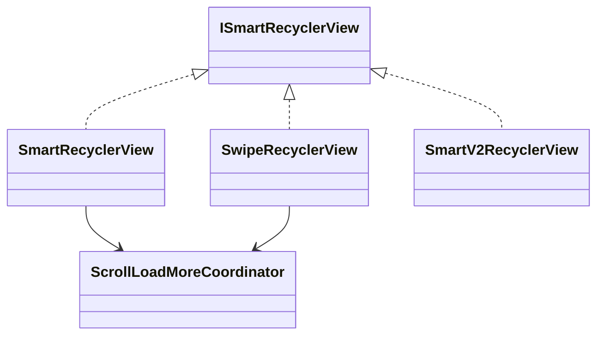

# PR1 详细设计：公共 Load More 逻辑抽取

## 1. 背景

当前项目中，以下两个类都实现了基于 `RecyclerView` 滚动事件触发加载更多的能力：

- `recyclerview_smartrefreshlayout/.../SmartRecyclerView.kt`
- `recyclerview_swiperefresh/.../SwipeRecyclerView.kt`

两者在以下方面存在明显重复：

- 滚动监听注册
- 是否允许触发加载更多的状态判断
- 底部触发阈值判断
- 加载更多状态更新
- 刷新完成与加载完成后的状态归位

这些重复逻辑会带来维护成本和回归风险，因此 PR1 先聚焦内部抽象，把公共逻辑收敛到 `recyclerview_core`。

## 2. PR1 目标

- 抽取 `SmartRecyclerView` 和 `SwipeRecyclerView` 的公共滚动 load more 逻辑
- 保持现有公开 API 不变
- 保持 sample 和业务调用方式不变
- 降低重复代码，给后续测试和文档整理打基础

## 3. 非目标

本次 PR 不处理以下内容：

- 不重构 `SmartV2RecyclerView`
- 不调整 `ISmartRecyclerView` 的公开接口定义
- 不修改 sample 的业务逻辑
- 不引入新的分页模型
- 不做 README 重写
- 不一次性收敛所有 smart/swipe 实现

## 4. 现状分析

### 4.1 当前重复点

`SmartRecyclerView` 与 `SwipeRecyclerView` 中重复的核心流程如下：

1. 监听 `RecyclerView.OnScrollListener`
2. 在 `SCROLL_STATE_IDLE` 时检查是否接近底部
3. 判断当前是否允许 load more
4. 切换状态为 `REFRESH_UP`
5. 通知 `onStateChanged(State.LOADING)`
6. 调用 `onLoadMore()`

此外，两者还重复维护了以下字段：

- `mRefreshEnable`
- `mLoadMoreEnable`
- `onRefreshListener`
- `onLoadMoreListener`
- `state`
- `loadMoreState`

### 4.2 当前差异点

两者真正不同的地方主要只有刷新容器的具体行为：

- `SmartRecyclerView`
  - 使用 `SmartRefreshLayout`
  - `autoRefresh()` 调用 `mSmartRefreshLayout.autoRefresh()`
  - `finishRefresh()` 调用 `mSmartRefreshLayout.finishRefresh(success)`

- `SwipeRecyclerView`
  - 使用 `SwipeRefreshLayout`
  - `autoRefresh()` 需要手动 `isRefreshing = true` 并主动分发 refresh 回调
  - `finishRefresh()` 需要手动 `isRefreshing = false`
  - 有额外日志输出

因此，PR1 的关键是把“公共状态与滚动触发逻辑”抽出来，让宿主类只处理“具体刷新控件行为”。

## 5. 设计原则

- 先抽象行为一致的部分，不抽象仍有明显差异的部分
- 保持类名、构造方式、调用链不变
- 优先使用组合，而不是继承
- 让共享行为成为可复用组件，而不是父类层级
- 允许 `SmartV2RecyclerView` 暂时不纳入抽象体系

## 6. 设计方案

### 6.1 新增组合组件

建议在 `recyclerview_core` 新增一个组合式协调类：

- `ScrollLoadMoreCoordinator`

建议位置：

- `recyclerview_core/src/main/java/com/qw/recyclerview/core/ScrollLoadMoreCoordinator.kt`

### 6.2 `ScrollLoadMoreCoordinator` 职责

该类负责：

- 保存与滚动 load more 相关的通用状态
  - `loadMoreEnable`
  - `onLoadMoreListener`
  - `loadMoreState`

- 注册并处理 `RecyclerView` 滚动监听
- 统一判断是否允许触发 load more
- 统一判断是否接近列表底部
- 接收宿主同步过来的 load more 状态
- 统一处理 `finishLoadMore()` 状态收敛
- 对外暴露宿主类可调用的方法，而不是通过继承扩展

此外，PR1 实际落地时已经同步把 load more 完成结果从布尔参数收敛为结果型表达：

- `LoadMoreResult.SUCCESS`
- `LoadMoreResult.NO_MORE`
- `LoadMoreResult.ERROR`

旧接口：

- `finishLoadMore(success: Boolean, noMoreData: Boolean)`

仍保留兼容，但内部统一转发到结果型接口。

### 6.3 宿主回调接口

为了避免 coordinator 直接耦合具体刷新容器，建议它通过一个很薄的宿主回调接口与外部协作。

例如可设计为内部接口或构造参数回调：

- `onLoadMoreTriggered()`
- `canTriggerLoadMore()`
- `markLoadMoreStarted()`
- `markLoadMoreFinished()`

同时，refresh 相关行为仍由宿主类自己维护：

- `setRefreshEnable`
- `autoRefresh`
- `refresh listener`
- `finishRefresh` 的 UI 收尾

换句话说，PR1 只把“滚动触发加载更多”和“load more 状态维护”这部分组合出去，不把 refresh 生命周期一起抽空。

### 6.4 coordinator 的边界

`ScrollLoadMoreCoordinator` 不应该理解 refresh 语义。

因此：

- 它不应该接收 `finishRefresh(success, footerState)` 这样的混合语义接口
- 它不应该知道 refresh 是否成功
- 它只应该接收自己关心的 load more 状态

建议宿主在 `finishRefresh(success, footerState)` 中自行拆解旧接口语义：

- 刷新 UI 收尾由宿主处理
- `refreshState` 归位由宿主处理
- `footerState` 通过 `syncLoadMoreState(state)` 同步给 coordinator

参考调用方式：

```kotlin
override fun finishRefresh(success: Boolean, footerState: State) {
    refreshState = ISmartRecyclerView.REFRESH_IDLE
    refreshContainer.finishRefresh(success)
    loadMoreCoordinator.syncLoadMoreState(footerState)
}
```

同样地，`ScrollLoadMoreCoordinator` 也不应该继续接收布尔组合语义的 load more 结果。

因此其内部最终收敛为：

- `finishLoadMore(result: LoadMoreResult)`

而不是继续以：

- `finishLoadMore(success: Boolean, noMoreData: Boolean)`

作为核心实现接口。

### 6.5 为什么 refresh 不拆

本次 PR1 不把 refresh 进一步抽到 coordinator 中，原因不是实现成本，而是职责边界本身就不适合这样做。

对于当前 Android 主流列表 UI 组合来说：

- 宿主持有的 refresh 容器通常已经自带 refresh 能力
- 不同容器的 refresh 行为和 API 差异明显
- 项目真正缺少的通用能力，更多是 load more

以当前项目为例：

- `SwipeRefreshLayout` 原生提供 refresh
- `SmartRefreshLayout` 原生提供 refresh
- 宿主类本身已经拥有自己的 refresh 生命周期和 UI 收尾方式

因此更合理的拆分不是“把 refresh 和 load more 都抽出去”，而是：

- 宿主继续保留 refresh 能力
- coordinator 专注补足 load more 能力

这个判断带来的直接收益是：

- 抽象边界更自然，符合控件原生职责
- 不会把不同 refresh 容器的差异硬塞进一层公共抽象
- 后续如果接入新的 refresh 容器，只需要更换宿主适配
- `ScrollLoadMoreCoordinator` 可以保持小而稳定

换句话说，PR1 不是要做一个“大一统列表控制器”，而是要补一块当前主流 UI 控件普遍缺失的能力。

### 6.6 `SmartRecyclerView` 改造方式

`SmartRecyclerView` 改为持有一个 `ScrollLoadMoreCoordinator` 实例，自身保留：

- `SmartRefreshLayout` 的 refresh listener 注册
- `setEnableRefresh`
- `autoRefresh`
- `finishRefresh` 的 refresh UI 收尾
- `SmartRefreshLayout` 自带参数配置
- `refreshState`

同时继续显式关闭 `SmartRefreshLayout` 自带的 load more：

- `mSmartRefreshLayout.setEnableLoadMore(false)`

`SmartRecyclerView` 在需要时把以下行为委托给 `ScrollLoadMoreCoordinator`：

- `setLoadMoreEnable`
- `setOnLoadMoreListener`
- `isUp`
- `finishLoadMore`
- `finishRefresh` 中通过 `syncLoadMoreState` 同步 load more 状态

### 6.7 `SwipeRecyclerView` 改造方式

`SwipeRecyclerView` 同样改为持有 `ScrollLoadMoreCoordinator`，自身保留：

- `SwipeRefreshLayout` 的 refresh listener 注册
- `isEnabled` 同步
- `isRefreshing = true/false`
- `autoRefresh` 的宿主行为
- 保留现有日志
- `refreshState`

### 6.8 为什么本次选组合

本次改为组合的主要原因：

- 共享的是行为，不是稳定的类型层级
- 后续如果再接入新的 refresh 容器，更容易复用
- 不会把状态和流程藏进父类，调试和 review 更直接
- 更利于后续做单测

### 6.9 `SmartV2RecyclerView` 处理策略

PR1 不纳入抽象。

原因：

- `SmartV2RecyclerView` 使用的是 `SmartRefreshLayout` 自带 load more 机制
- 它的加载更多触发来源与 `SmartRecyclerView` / `SwipeRecyclerView` 不同
- 如果强行一起抽，会扩大 PR 风险和设计复杂度

后续可在 PR3 或单独 issue 中评估它的长期定位。

## 7. 类关系草图



## 8. 具体改动文件

### 新增

- `recyclerview_core/src/main/java/com/qw/recyclerview/core/ScrollLoadMoreCoordinator.kt`
- `recyclerview_core/src/main/java/com/qw/recyclerview/loadmore/LoadMoreResult.kt`

### 修改

- `recyclerview_core/src/main/java/com/qw/recyclerview/core/ISmartRecyclerView.kt`
- `recyclerview_smartrefreshlayout/src/main/java/com/qw/recyclerview/smartrefreshlayout/SmartRecyclerView.kt`
- `recyclerview_swiperefresh/src/main/java/com/qw/recyclerview/swiperefresh/SwipeRecyclerView.kt`

### 不改

- sample 业务调用代码

说明：

- `SmartV2RecyclerView` 不纳入 load more 协调器抽象，但会同步支持新的结果型 `finishLoadMore(result)` 接口
- sample 会同步迁移到 `LoadMoreResult` 调用方式，避免继续扩散旧布尔接口

## 9. 行为保持要求

PR1 改完后，以下行为必须保持一致：

- `setRefreshEnable()` 行为不变
- `setLoadMoreEnable()` 行为不变
- `autoRefresh()` 的对外效果不变
- `finishRefresh()` 的 footer 状态联动不变
- `finishLoadMore()` 的状态收敛不变
- `NO_MORE / ERROR / EMPTY` 时不重复触发 load more
- 列表滚动到底附近时仍按原阈值触发 load more

另外还要保证：

- `SmartRecyclerView` 与 `SwipeRecyclerView` 的 refresh 容器行为差异保持不变
- coordinator 不会改变现有 refresh 回调触发时机

## 10. 风险点

### 10.1 触底判断差异

当前代码里 `StaggeredGridLayoutManager` 的最后可见项逻辑写法不够稳，PR1 如果顺手优化，可能引入行为变化。

本次建议：

- 保持语义尽量一致
- 如需优化实现，必须明确记录属于“等价优化”

### 10.2 autoRefresh 行为差异

`SwipeRecyclerView` 当前是手动设置 `isRefreshing = true` 并直接回调 `onRefreshListener`，与 `SmartRecyclerView` 的容器行为不同。

本次建议：

- 仅保留原有差异，不尝试统一外观行为

### 10.3 状态收尾遗漏

如果 coordinator 抽象边界不清晰，可能导致：

- `finishRefresh()` 后没有正确归位
- `finishLoadMore()` 后状态残留
- `onStateChanged()` 触发顺序与原逻辑不一致

因此需要明确：

- 哪些状态由宿主维护
- 哪些状态由 `ScrollLoadMoreCoordinator` 维护
- 状态切换入口尽量收敛到少数几个方法

建议边界如下：

- 宿主维护：`refreshEnable`、`onRefreshListener`、`refreshState`
- coordinator 维护：`loadMoreEnable`、`onLoadMoreListener`、`loadMoreState`

这个边界也对应一个更底层的判断：

- refresh 属于宿主 UI 容器的原生能力
- load more 属于项目层补齐的增强能力

## 11. 验证点

### 11.1 静态验证

- 两个类重复代码显著减少
- 对外方法签名不变
- sample 不需要改调用代码
- 组合对象职责清晰，没有出现新的“隐形父类式 coordinator”

### 11.2 行为验证

- 下拉刷新仍正常触发
- 滚动到底仍能触发加载更多
- 加载失败后不会继续自动触发
- 无更多数据后不会继续自动触发
- 刷新完成后 footer 状态仍正常更新

## 12. 实施步骤

1. 新增 `ScrollLoadMoreCoordinator`
2. 搬迁滚动 load more 相关逻辑到 coordinator
3. 明确宿主与 coordinator 的状态边界
4. 改造 `SmartRecyclerView`
5. 改造 `SwipeRecyclerView`
6. 编译验证相关模块
7. 检查 sample 页面核心行为
8. 再进入 README 与测试补齐阶段

## 13. 完成定义

满足以下条件即可视为 PR1 完成：

- 已新增组合式公共 coordinator
- `SmartRecyclerView` 和 `SwipeRecyclerView` 已接入该 coordinator
- 对外 API 无破坏
- 基本行为保持一致
- 文档中已记录设计边界和风险点
