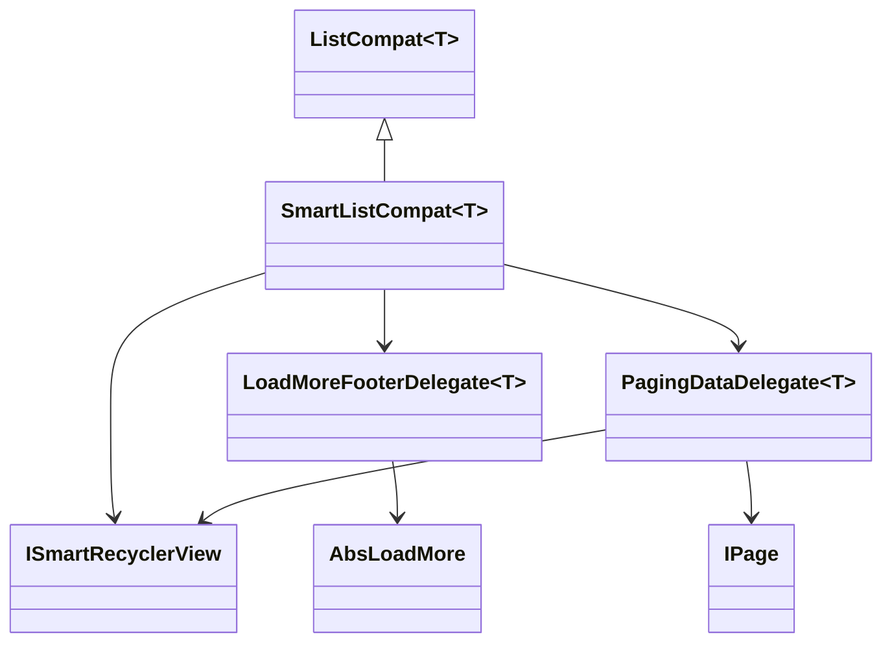

# PR3 详细设计：SmartListCompat 职责拆分

## 1. 背景

在 PR1 之后，项目已经完成以下收敛：

- `SmartRecyclerView` / `SwipeRecyclerView` 的公共 `scroll + load more` 行为已下沉到 `ScrollLoadMoreCoordinator`
- `finishLoadMore(success, noMoreData)` 已开始向 `LoadMoreResult` 收敛

接下来，最重的单点已经转移到 `SmartListCompat`。

当前 `SmartListCompat` 同时承担：

- 列表模板能力
- load more footer UI 行为
- retry 逻辑
- 分页数据落地
- refresh / load more 宿主桥接

这些职责虽然组合后使用顺手，但已经明显超出一个模板类应有的范围，后续继续扩展会让维护成本上升。

因此 PR3 的目标是：在不破坏 `SmartListCompat` 外部使用方式的前提下，先完成内部职责拆分。

## 2. PR3 目标

- 让 `SmartListCompat` 保留 facade 角色
- 将 footer / retry / load more UI 逻辑拆到独立 delegate
- 将分页数据落地逻辑拆到独立 delegate
- 为后续 API 命名收敛和测试补齐打基础

## 2.1 当前状态

PR3 当前已完成：

- `PR3-A`
  - 已新增 `LoadMoreFooterDelegate`
  - footer / retry / footer state 相关逻辑已从 `SmartListCompat` 中下沉

- `PR3-B`
  - 已新增 `PagingDataDelegate`
  - `setUpPage` / `notifyDataChanged` / `notifyError` 的核心分页落地逻辑已下沉

- `PR3-C`
  - 已新增更清晰的 facade API：
    - `setPaging`
    - `setLoadMoreView`
    - `submitPageData`
    - `submitPageError`
  - 旧命名仍保留兼容，并通过 `@Deprecated + ReplaceWith` 引导迁移

## 3. 非目标

本次 PR 不处理以下内容：

- 不移除 `SmartListCompat`
- 不把业务方改成自己手动拼装多个新对象
- 不直接重写 `ListCompat`
- 不在本次 PR 中大规模变更 public API 命名
- 不顺手引入新的分页协议

## 4. 当前职责分析

### 4.1 当前 `SmartListCompat` 实际承担的职责

#### A. 列表模板职责

- `onCreateBaseViewHolder`
- `getItemViewTypeByPosition`
- `MultiTypeBuilder`

#### B. 宿主桥接职责

- `autoRefresh`
- `finishRefresh`
- `finishLoadMore`
- `setRefreshEnable`
- `setLoadMoreEnable`
- `setOnRefreshListener`

#### C. footer / retry / load more UI 职责

- `typeLoadMore`
- `setUpLoadMore`
- `setOnLoadMoreListener` 中的 footer 状态联动
- `onCreateViewHolder` 的 footer 分支
- `getItemCount`
- `getItemViewType`
- `getGridLayoutManager` 中 footer 全宽逻辑
- retry 触发 `onLoadMore()`

#### D. 分页数据落地职责

- `setUpPage`
- `notifyDataChanged`
- `notifyError`

### 4.2 当前问题

- footer 逻辑和分页逻辑与模板职责耦合过深
- `notifyDataChanged` / `notifyError` 命名偏泛，但实际上依赖分页语义
- `page` 使用 `lateinit`，调用顺序不当时有运行时风险
- `setOnLoadMoreListener` 同时承担业务监听注册和 footer UI 绑定职责

## 5. 拆分原则

- `SmartListCompat` 保留 facade，减少业务接入层震荡
- 优先拆内部协作对象，而不是直接新增一堆 public API
- 新拆出的对象表达“组件内部职责”，不使用 `UseCase` 命名
- 先拆耦合最重的 footer，再拆分页数据落地

## 6. 推荐命名

本次不建议使用 `UseCase` 命名。

原因：

- `UseCase` 更像业务意图层对象
- 当前拆分对象属于 UI 组件内部职责协作
- `UseCase` 会把职责语义引向领域层，造成误解

因此本次推荐使用：

- `LoadMoreFooterDelegate`
- `PagingDataDelegate`

## 7. 目标结构

## 8. 设计方案

### 8.1 `SmartListCompat` 保留 facade

`SmartListCompat` 继续作为业务侧接触到的主入口。

它负责：

- 持有 `smart: ISmartRecyclerView`
- 持有 `modules`
- 对外暴露链式配置
- 组织 delegate 协作
- 保留模板入口

它不再直接承担 footer 与分页数据落地细节。

### 8.2 抽 `LoadMoreFooterDelegate`

#### 负责范围

- `AbsLoadMore` 视图配置
- footer item 是否展示
- footer viewType
- footer view holder 创建
- footer 状态同步
- retry 回调桥接
- grid / staggered grid 下 footer 跨列逻辑

#### 预期接管的现有逻辑

- `typeLoadMore`
- `isLoadMoreShow`
- `setUpLoadMore`
- `setOnLoadMoreListener` 中与 footer state 绑定的部分
- `onCreateViewHolder` 的 footer 分支
- `getItemCount` 中额外 footer 项
- `getItemViewType` 的 footer 分支
- `getGridLayoutManager` 中的 footer span 判断

#### 为什么先拆它

- UI 耦合最重
- retry / footer / state 联动最容易继续膨胀
- 对 `SmartListCompat` 的体积缩减最直接

### 8.3 抽 `PagingDataDelegate`

#### 负责范围

- 持有 `IPage`
- 将 `IPage` 作为“分页状态机”协作对象，而不是 UI 手势语义接口
- 根据 `page.state.action` 判断当前是 refresh 还是 load more
- 分页成功时如何更新 `modules`
- 分页成功后如何决定 `LoadMoreState.SUCCESS / NO_MORE`
- 分页失败时如何落 UI

#### `IPage` 的职责边界

`IPage` 更适合作为分页状态源，而不是表达“下拉 / 上拉”这类 UI 动作。

因此更推荐它承载以下语义：

- 记录加载第一页
- 记录加载下一页
- 提交成功请求结果
- 提交失败请求结果
- 判断当前是否首屏请求
- 判断后续是否还有下一页
- 输出当前分页状态用于驱动 UI

这意味着后续命名收敛方向应尽量靠近：

- `onLoadFirstPage()`
- `onLoadNextPage()`
- `isLoadFirstPage()`
- `hasNextPage()`
- `onLoadSuccess(hasNextPage)`
- `onLoadFailure()`

而诸如：

- `requestPage`
- `cursor`
- `lastDataId`

这类“具体请求参数”不应成为 `IPage` 抽象层的正式契约，而应由具体实现类自己维护。

而不是继续把：

- `pullToDown()`
- `pullToUp()`
- `onPageChanged()`

作为推荐主语义接口对外扩散。

当前 `IPage` 已经会通过 `PageState` 向上层暴露：

- 当前行为：`PageAction`
- 当前阶段：`PagePhase`
- 是否还有下一页
- 当前是否为第一页请求

因此 `PagingDataDelegate` 当前优先基于 `page.state` 驱动 UI，而不是继续把 refresh / load more 判断完全交给宿主 smart 状态。

#### 预期接管的现有逻辑

- `setUpPage`
- `notifyDataChanged`
- `notifyError`

#### 预期价值

- 把“分页结果落到 UI”的语义单独封装
- 避免 `SmartListCompat` 同时承载模板和分页流程
- 为后续把 `notifyDataChanged` / `notifyError` 收敛成更清晰命名创造条件

### 8.4 `ListCompat` 暂不调整

当前 `ListCompat` 仍然比较纯粹：

- 持有 `modules`
- 持有 `adapter`
- 提供基础列表壳子

因此 PR3 不建议扩大范围去重写它。

## 9. 分阶段落地建议

### PR3-A

- 新增 `LoadMoreFooterDelegate`
- `SmartListCompat` 将 footer 相关逻辑委托给该对象
- 保持现有外部 API 不变
- 当前状态：已完成

### PR3-B

- 新增 `PagingDataDelegate`
- `SmartListCompat` 将分页结果处理逻辑委托给该对象
- 保持 `setUpPage` / `notifyDataChanged` / `notifyError` 仍可用
- 当前状态：已完成

### PR3-C

- 评估 public API 命名收敛
- 例如：
  - `setUpPage` -> `setPaging`
  - `notifyDataChanged` -> `submitPageData`
  - `notifyError` -> `submitPageError`
  - `setUpLoadMore` -> `setLoadMoreView`

这一阶段可以通过 `@Deprecated + ReplaceWith` 渐进推进。
- 当前状态：已完成首轮收敛

## 10.1 当前已落地的最终结构

当前 `SmartListCompat` 已经收敛为：

- 继续保留 facade
- footer / retry / footer state 交给 `LoadMoreFooterDelegate`
- 分页数据落地交给 `PagingDataDelegate`
- 对外新增更清晰的方法名，但仍保持旧调用兼容

## 11. 风险点

### 10.1 调用顺序问题

当前 `page` 已不再通过 `lateinit` 保存在 `SmartListCompat` 中，而是由 `PagingDataDelegate` 持有并在未设置时给出更明确异常信息。

建议在拆分时同时评估：

- 是否改为 nullable
- 或者在未设置 page 时给出更清晰异常信息

### 10.2 footer 与业务 listener 顺序

当前 `setOnLoadMoreListener` 既管业务 listener，又管 footer 状态同步。

拆分后要避免：

- footer 状态不同步
- retry 不再触发业务 `onLoadMore()`
- state 回调顺序变化

### 10.3 `getItemCount` / `getItemViewType` 行为回归

footer 相关逻辑拆分后，最容易影响：

- footer 展示时机
- grid / staggered grid 跨列行为
- retry 时的 item 刷新位置

## 12. 完成定义

满足以下条件即可视为 PR3 完成：

- `SmartListCompat` 仍保留 facade 角色
- footer / retry / load more UI 逻辑已抽离
- 分页数据落地逻辑已抽离
- 现有 sample 使用方式基本不变
- 首轮 API 命名收敛已经落地
